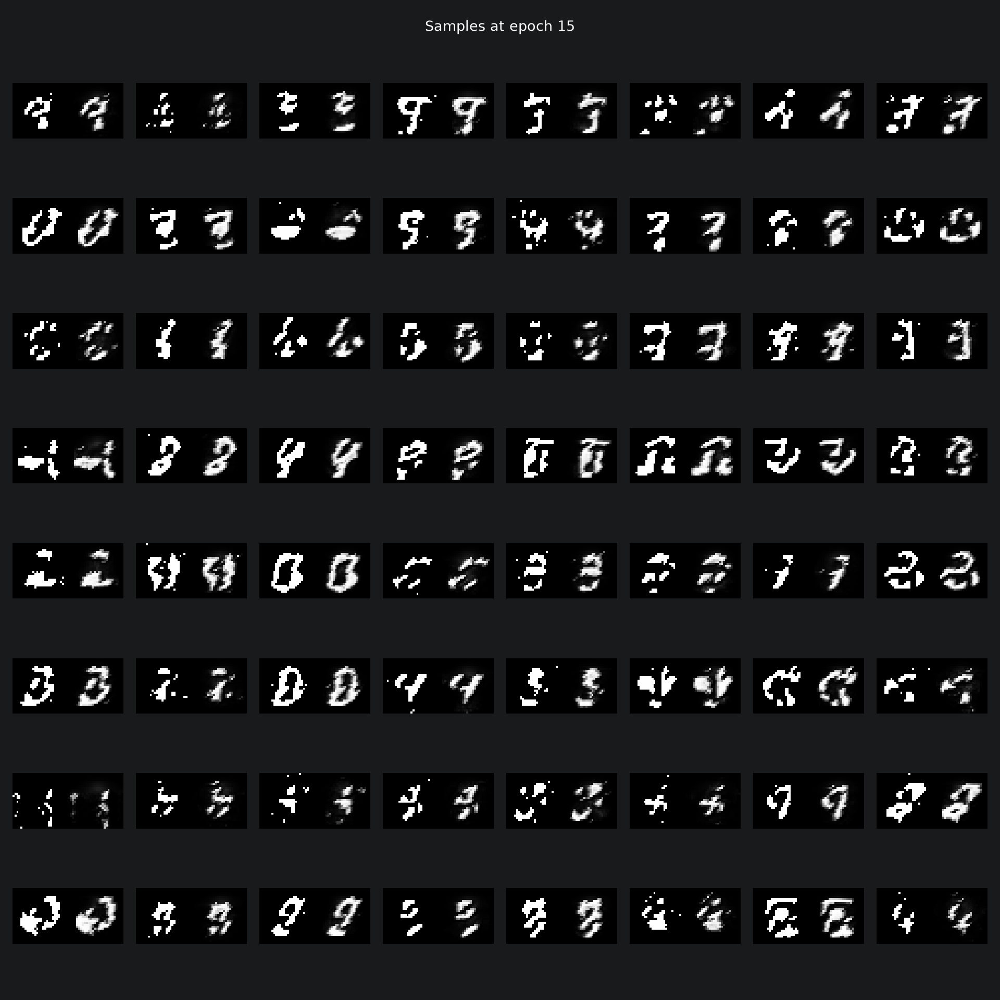

# Note

This repository is a bit of fun, following Stanford's CS236 [course](https://www.youtube.com/watch?v=XZ0PMRWXBEU&list=PLoROMvodv4rPOWA-omMM6STXaWW4FvJT8) on "Deep Generative Models".

# Technologies

* PyTorch;
* hydra; and
* the usual suspects (matplotlib, numpy, pytest, ...).

# Introduction

In general, for generative AI, we want to estimate the joint probability density function
$$
p(x_1, \ldots, x_n).
$$

The chain rule for probability gives
$$
p(x_1, \ldots, x_{n}) = p(x_1) \, p(x_2 \,|\, x_1) \,\cdots\, p(x_n \,|\, x_{n-1}, \ldots, x_1).
$$

The above problem is intractable, so we need to make some assumptions.

We assume a raster-scan ordering of our variables from top-left $X_1$ to bottom-right $X_{n=784}$.

# Data

We use the binarised MNIST dataset. My mac might explode, otherwise.

# Models

## Fully Visible Sigmoid Belief Network

### Definition

Assume a parameterisation of each conditional probability

$$
p(x_1, \ldots, x_{n}) = p_{\text{CPT}}(x_1; \alpha_1) \, p_{\text{logit}}(x_2 \,|\, x_1; \alpha_2) \,\cdots\, p_{\text{logit}}(x_n \,|\, x_{n-1}, \ldots, x_1; \alpha_n),
$$
where
$$
P_{\text{CPT}}(X_1 = 1; \alpha_1) = \alpha_1, \; P_{\text{CPT}}(X_1 = 0; \alpha_1) = 1 - \alpha_1,
$$
$$
P_{\text{logit}}(X_2 = 1 \,|\, x_1; \alpha_2) = \sigma(\alpha_0^2 + \alpha_1^2x_1)
$$
and $\sigma$ is the softmax function.

## Results

## Neural Autodensity Estimation

### TODO: Translate old ipynb to new hydra-based experiment and generate some pretty pictures!

## Masked Autodensity Estimation

### TODO: Translate old ipynb to new hydra-based experiment and generate some pretty pictures!

## Masked Autodensity Estimation (conditioned)

### TODO: Translate old ipynb to new hydra-based experiment and generate some pretty pictures!

## Recursive Neural Network

### TODO: Translate old ipynb to new hydra-based experiment and generate some pretty pictures!