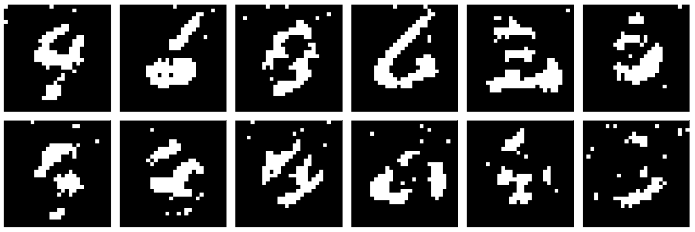
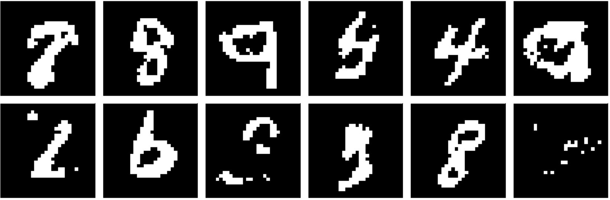
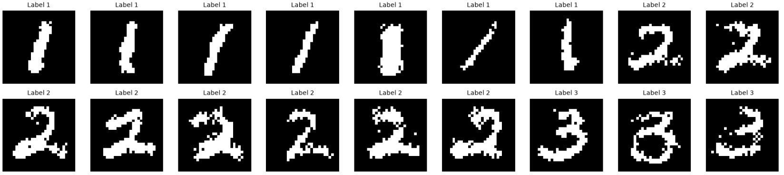

# This Repository

In this repository I am exploring the foundations of generative AI and implementing some ideas from scratch.

I'm mainly following [Stanford's CS236: Deep Generative Models](https://www.youtube.com/watch?v=XZ0PMRWXBEU&list=PLoROMvodv4rPOWA-omMM6STXaWW4FvJT8), 
along with papers and other resources as I go.

Please note that my focus is on understanding how the models work, rather than optimising for state-of-the-art sample quality!

| Status | Topic                              | Report                                                                             |
|--------|------------------------------------|------------------------------------------------------------------------------------|
| ✅      | FVSBN                              | [Hugging Face](https://huggingface.co/spaces/MattGalton/ml-genai-01-fvsbn)         |
| ✅      | NADE                               | [Hugging Face](https://huggingface.co/spaces/MattGalton/ml-genai-02-nade)          |
|        | MADE                               |                                                                                    |
| ✅      | Conditional MADE                   | [Hugging Face](https://huggingface.co/spaces/MattGalton/ml-genai-04-made-conditional) |
|        | Vanilla RNN                        | |
|        | VAEs                               | |
|        | Normalising Flows                  | |
|        | GANs                               | |
|        | Energy-based models                | |
|        | Score-based models                 | |
|        | Score-based diffusion models       | |
|        | Discrete latent variable models    | |
|        | Diffusion models for discrete data | |

## Technologies Used

* PyTorch;
* PyTorch Lightning;
* hydra; 
* hugging face; and
* the usual suspects (matplotlib, numpy, pytest, ...).

# Datasets

I am going to use very simple datasets so I can focus on the maths (and to be kind to my Mac).
This way, when the world is run by machines, I will be looked upon favourably.

For example, I'll use datasets such as 
* binarised MNIST;
* characters from a finite alphabet (e.g. `{'h', 'e', 'l', 'o'}`);
* words from a finite vocabulary (e.g. Wikipedia articles).

# Generative AI

## Introduction

In general, for generative AI, we want to estimate the joint probability density function

```math
p(x_1, \ldots, x_n).
```

We can then use our estimate of the density function to sample images!

## Autoregressive Models

The chain rule for probability gives

```math
p(x_1, \ldots, x_{n}) = p(x_1) \, p(x_2 \,|\, x_1) \,\cdots\, p(x_n \,|\, x_{n-1}, \ldots, x_1).
```

Note that the conditional distribution for each variable (pixel!) $x_i$ depends **only on the variables preceding it**.
This is an important feature that **must** be preserved, called causality.

More generally, each variable can be conditioned on any subset of variables 
that precede it in a valid ordering, 
provided the resulting dependency graph is a directed acyclic graph (DAG). This can be seen as
an approximation to the full chain rule disintegration of the joint density.

### Sampling

The autoregressive structure gives a straightforward way to generate
new images.

Variables are sampled sequentially from the learned conditional
distributions:

```math
x_1 \sim p(x_1),
```

then

```math
x_2 \sim p(x_2\mid x_1),
```

and so on until

```math
x_{n}
\sim
p(x_{n}\mid x_1,\ldots,x_{n-1}).
```

Each newly sampled variable becomes part of the conditioning information
used to generate the next pixel.

Note that sampling cannot be performed for all
variables independently in a single step: each variable depends on the samples
generated before it.

# Experiments

## 01 Fully Visible Sigmoid Belief Network (FVSBN)

A simple autoregressive neural density estimator.

**[→ View the report](https://huggingface.co/spaces/MattGalton/ml-genai-01-fvsbn)**



## 02 Neural Autoregressive Density Estimation (NADE)

An implementation of NADE, 
which introduces parameter sharing to make autoregressive 
density estimation more efficient.

**[→ View the report](https://huggingface.co/spaces/MattGalton/ml-genai-02-nade)**



## 03 Masked Autoencoder for  Density Estimation (MADE)

MADE assigns degrees randomly to nodes, enforcing causality by restricting what
degrees are allowed for downstream nodes in the hidden and output layers.

Re-initialising the mask periodically encourages the whole network to learn the structure of the data.


## 04 (Conditional) Masked Autoencoder for  Density Estimation (MADE)

Given a data point $x$ and its label $y$, we estimate the conditional density $p(x \, | \, y)$.
Conditioning on $y$ allows us to estimate a different distribution over $x$ for each class.

If we want to sample from the full joint distribution, we can use 
```math
p(x, y) = p(x\, | \, y) p(y)
```
and sample $\tilde y \sim p(y)$, then $\tilde x \sim p(x \, | \, \tilde y)$.

Appending a one-hot label to the end of the input and allowing it to fully connect to nodes in the next layer lets us
generate samples given a label.

**[→ View the report](https://huggingface.co/spaces/MattGalton/ml-genai-04-made-conditional)**


